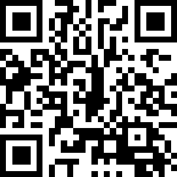

# QR Code Generator for Salesforce Marketing Cloud
A Server-Side JavaScript (SSJS) application for use in email and landing pages.



## Supported Formats
- HTML Table
- Scalable Vector Graphics (SVG)

## Examples
```
<script runat="server">

    <!-- src/qrcode.sfmc.ssjs.js -->

    var qrCodeHTMLTable = new QRCode("https://www.salesforce.com").table();
    
    Write(qrCodeHTMLTable);

    var qrCodeSVG = new QRCode({
        "content" : "https://www.salesforce.com",
        "padding" : 0,
        "width": 300,
        "height": 300,
        "color": "black",
        "background": "white",
        "ecl" : "L",
        "pretty" : false
    }).svg();
    
    Write("<br>");
    Write(qrCodeSVG);

</script>
```

## Options

| Name | Default | Required | Description |
| --- | --- | --- | --- |
| `content` | `undefined` | Yes | The text string/URL to encode (e.g., https://www.salesforce.com) |
| `width` | 300 | No | The width of the QR code, in pixels |
| `height` | 300 | No | The height of the QR code, in pixels |
| `color` | #000000 | No | The color name/hex value of the data modules |
| `background` | #ffffff | No | The color name/hex value of the background |
| `ecl` | L | No | The [error correction level](https://en.wikipedia.org/wiki/QR_code#Error_correction) of the QR code |
| `pretty` | `true` | No | Apply indents and new lines to returned text |

 ### SVG-only Options
 | Name | Default | Required | Description |
 | --- | --- | --- | --- |
 | `padding` | 0 | No | The amount of white space around the image, in modules |
 | `join` | `false` | No | Join modules into one SVG path, i.e. for crisp rendering |
 | `predefined` |  `false` | No | Use 'defs' and 'use' elements in SVG, i.e. for compact output |
 | `xmlDeclaration` | `false` | No | Prepend XML declaration to the SVG document |
 | `container` | svg | No | Wrapping element (svg/svg-viewbox/g/none; see below) |
 
#### SVG container options:
- **svg** - populate squares in a SVG document with width and height attribute, recommended for converting to raster images or PDF where QR Code is being static (exact size)
 - **svg-viewbox** - populate squares in a SVG document with viewBox attriute, recommended for responsive web pages
 - **g** - put squares in g element, useful when you need to put multiple QR Codes in a single SVG document
 - **none** - no wrapper

## Version History
This repo is a fork of [qrcode-svg](https://github.com/papnkukn/qrcode-svg), itself a fork of [qrcodejs](https://github.com/davidshimjs/qrcodejs). Both use client-side JavaScript to render QR codes in the browser, whereas this library is intended to run on the Marketing Cloud server. To make this possible, each function was downgraded to ECMAScript 3, removing references to the DOM along with unsupported features and keywords. Further optimizations and bug fixes can be submitted via a pull request.
